# The note for the exercise of CSC_5SE02_TP

## 1.1 Domain Analysis

The overall class diagram is shown as follows:


<div align="center">
  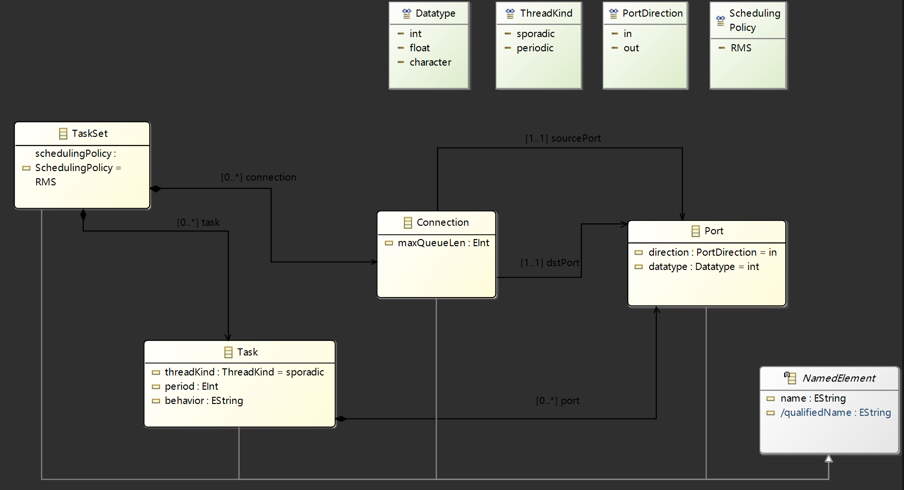
</div>

## 1.2 Model Elements Naming

### `PortImpl.java`
The qualified name is computed in the form of {task name}.{port name}. For example, 
`T1.po`. Insert this block into the code:
```java
/**
 * <!-- begin-user-doc -->
 * <!-- end-user-doc -->
 * * * @generated NOT
 */
@Override
public String getQualifiedName() {
    if (this.eContainer() instanceof Task) {
        Task parentTask = (Task) this.eContainer();
        return parentTask.getName() + "." + this.getName();
    }
    return super.getQualifiedName();
}
```

### `ConnectionImpl.java`
The qualified name is computed in the form of `{name}:{source port qualified 
name}->{destination port qualified name}`. 
For example, `connection:T1.po->T2.pi`.

```java
	/**
	 * * * @generated NOT
	 */
	@Override
	public String getQualifiedName() {
	    String sourceName = (this.getSourcePort() != null) ? this.getSourcePort().getQualifiedName() : "null";
	    String destName = (this.getDstPort() != null) ? this.getDstPort().getQualifiedName() : "null";
	    
	    return this.getName() + ":" + sourceName + "->" + destName;
	}
```

### `NamedElementImpl.java`
```java
/**
 * <!-- begin-user-doc -->
 * <!-- end-user-doc -->
 * @generated NOT
 */
@Override
public String getQualifiedName() {
    return this.getName();
}
```


## 2.1 Uniqueness of Qualified Names
Adding annotations.

### Class `Taskset`
- Function `UniqueTaskNames`

    ```java
    /**
     * <!-- begin-user-doc -->
     * <!-- end-user-doc -->
     * @generated NOT
     */
    public boolean validateTaskSet_UniqueTaskNames(TaskSet taskSet, DiagnosticChain diagnostics, Map<Object, Object> context) {
        Set<String> existingNames = new HashSet<>();

        for (Task t : taskSet.getTask()) {
            if (t.getName() != null) {
                if (!existingNames.add(t.getName())) {
                    if (diagnostics != null) {
                        diagnostics.add(new BasicDiagnostic(
                            Diagnostic.ERROR,
                            DIAGNOSTIC_SOURCE,
                            0,
                            "Task name '" + t.getName() + "' is not unique in the TaskSet.",
                            new Object[] { taskSet }
                        ));
                    }
                    return false;
                }
            }
        }
        return true;
    }
    ```

### Class `Task`
- Function `UniquePortNames`

    ```java
    /**
     * <!-- begin-user-doc -->
     * <!-- end-user-doc -->
     * @generated NOT
     */
    public boolean validateTask_UniquePortNames(Task task, DiagnosticChain diagnostics, Map<Object, Object> context) {
        Set<String> existingNames = new HashSet<>();

        for (Port p : task.getPort()) {
            if (p.getName() != null) {
                if (!existingNames.add(p.getName())) {
                    if (diagnostics != null) {
                        diagnostics.add(new BasicDiagnostic(
                            Diagnostic.ERROR, DIAGNOSTIC_SOURCE, 0,
                            "Port name '" + p.getName() + "' is not unique within Task '" + task.getName(),
                            new Object[] { task }
                        ));
                    }
                    return false;
                }
            }
        }
        return true;
    }
    ```

- Function `ValidQueueSize`
    ```java
    /**
     * Validates the ValidQueueSize constraint of '<em>Connection</em>'.
     * <!-- begin-user-doc -->
     * <!-- end-user-doc -->
     * @generated NOT
     */
    public boolean validateConnection_ValidQueueSize(Connection connection, DiagnosticChain diagnostics, Map<Object, Object> context) {
        if (connection.getSourcePort() != null && connection.getDstPort() != null) {
            
            // Find the corresponding Task with eContainer()
            Task srcTask = (Task) connection.getSourcePort().eContainer();
            Task dstTask = (Task) connection.getDstPort().eContainer();
            
            if (srcTask != null && dstTask != null) {
                int srcPeriod = srcTask.getPeriod();
                int dstPeriod = dstTask.getPeriod();

                int maxQueueLen = connection.getMaxQueueLen();
                
                if (srcPeriod > 0) {
                    // dst.period/src.period
                    int requiredLen = (int) Math.ceil((double) dstPeriod / srcPeriod);

                    if (maxQueueLen < requiredLen) {
                        if (diagnostics != null) {
                            diagnostics.add(new BasicDiagnostic(
                                Diagnostic.ERROR, DIAGNOSTIC_SOURCE, 0,
                                "Connection error: 'maxQueueLen' (" + maxQueueLen + ") is too small. " +
                                "Task '" + srcTask.getName() + "' (period:" + srcPeriod + ") produces data faster than " +
                                "Task '" + dstTask.getName() + "' (period:" + dstPeriod + ") can consume. " +
                                "Minimum required queue length is " + requiredLen + ".",
                                new Object[] { connection }
                            ));
                        }
                        return false;
                    }
                }
            }
        }
        return true;
    }
    ```

### Class `Connection`
- Function `SameDatatype`
    ```java
	/**
	 * <!-- begin-user-doc -->
	 * <!-- end-user-doc -->
	 * @generated NOT
	 */
	public boolean validateConnection_SameDatatype(Connection connection, DiagnosticChain diagnostics, Map<Object, Object> context) {
	    if (connection.getSourcePort() != null && connection.getDstPort() != null) {

	        Object srcType = connection.getSourcePort().getDatatype();
	        Object dstType = connection.getDstPort().getDatatype();

	        if (srcType != null && dstType != null) {

	            if (!srcType.equals(dstType)) {
	                if (diagnostics != null) {
	                    diagnostics.add(new BasicDiagnostic(
	                        Diagnostic.ERROR, DIAGNOSTIC_SOURCE, 0,
	                        "Connection '" + connection.getName() + "' must link ports with the same data type. " +
	                        "(Source is " + srcType + ", but Destination is " + dstType + ")",
	                        new Object[] { connection }
	                    ));
	                }
	                return false;
	            }
	        }
	    }
	    return true;
	}
    ```

- Function `ValidDirection`
    ```java
	/**
	 * <!-- begin-user-doc -->
	 * <!-- end-user-doc -->
	 * @generated NOT
	 */
	public boolean validateConnection_ValidDirection(Connection connection, DiagnosticChain diagnostics, Map<Object, Object> context) {
	    boolean isValid = true;
	    
	    // Src port must be OUT
	    if (connection.getSourcePort() != null && connection.getSourcePort().getDirection() != PortDirection.OUT) {
	        isValid = false;
	    }
	    // Dst port must be IN
	    if (connection.getDstPort() != null && connection.getDstPort().getDirection() != PortDirection.IN) {
	        isValid = false;
	    }
	    
	    if (!isValid) {
	        if (diagnostics != null) {
	            diagnostics.add(new BasicDiagnostic(
	                Diagnostic.ERROR, DIAGNOSTIC_SOURCE, 0,
	                "Connection '" + connection.getName() + "': Source port MUST be 'out' and Destination port MUST be 'in'.",
	                new Object[] { connection }
	            ));
	        }
	        return false;
	    }
	    return true;
	}
    ```

The following picture shows that the validate methods suceed.

<div align="center">
  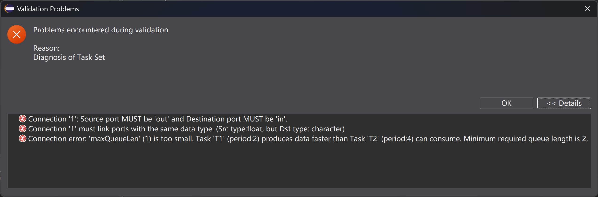
</div>

### Utilization: avoiding obtaining simply `Name` instead of `QualifiedName`, and let the graph be able to refresh in real-time.

Modify `PortItemProvider.java` in the project `/fr.se301b.tasksetmodel.edit/src/tasksetmodel/provider`. Replace the corresponding function `getText`:

```java
/**
 * This returns the label text for the adapted class.
 * <!-- begin-user-doc -->
 * <!-- end-user-doc -->
 * @generated NOT
 */
@Override
public String getText(Object object) {
    String label = ((Port)object).getQualifiedName();
    return label == null || label.length() == 0 ?
        getString("_UI_Port_type") :
        getString("_UI_Port_type") + " " + label;
}
```
Also in `ConnectionItemProvider.java`：
```java
/**
 * This returns the label text for the adapted class.
 * <!-- begin-user-doc -->
 * <!-- end-user-doc -->
 * @generated NOT
 */
@Override
public String getText(Object object) {
    String label = ((Connection)object).getQualifiedName();
    return label == null || label.length() == 0 ?
        getString("_UI_Connection_type") :
        getString("_UI_Connection_type") + " " + label;
}
```
and
```java
/**
 * This handles model notifications by calling {@link #updateChildren} to update any cached
 * children and by creating a viewer notification, which it passes to {@link #fireNotifyChanged}.
 * <!-- begin-user-doc -->
 * <!-- end-user-doc -->
 * @generated NOT
 */
@Override
public void notifyChanged(Notification notification) {
    updateChildren(notification);

    switch (notification.getFeatureID(Connection.class)) {
        case TasksetmodelPackage.CONNECTION__NAME:
        case TasksetmodelPackage.CONNECTION__SOURCE_PORT:
        case TasksetmodelPackage.CONNECTION__DST_PORT:
            fireNotifyChanged(new ViewerNotification(notification, notification.getNotifier(), false, true));
            return;
    }
    super.notifyChanged(notification);
}
```

## 3.1 Behavior of Tasks
Add a behavior string attribute to your task class to store the behavior code of the
thread. and regenerate the metamodel code. The following picture shows success in setting the behavior string attribute.

<div align="center">
  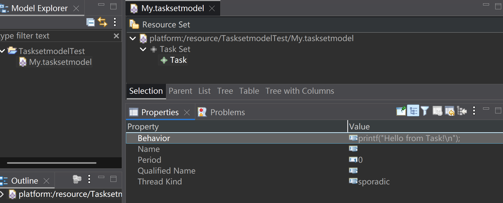
</div>

## 3.2 Runtime
My platform is `Windows 11`. This picture is the execution result on `WSL`.

<div align="center">
  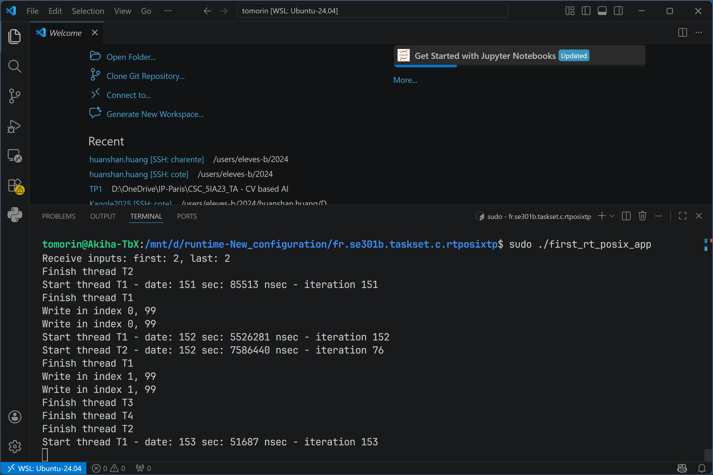
</div>

## 3.3 Model-to-Text Transformation

### 3.3.1 Creating a first Copy Transformation

See the following workspace.

<div align="center">
  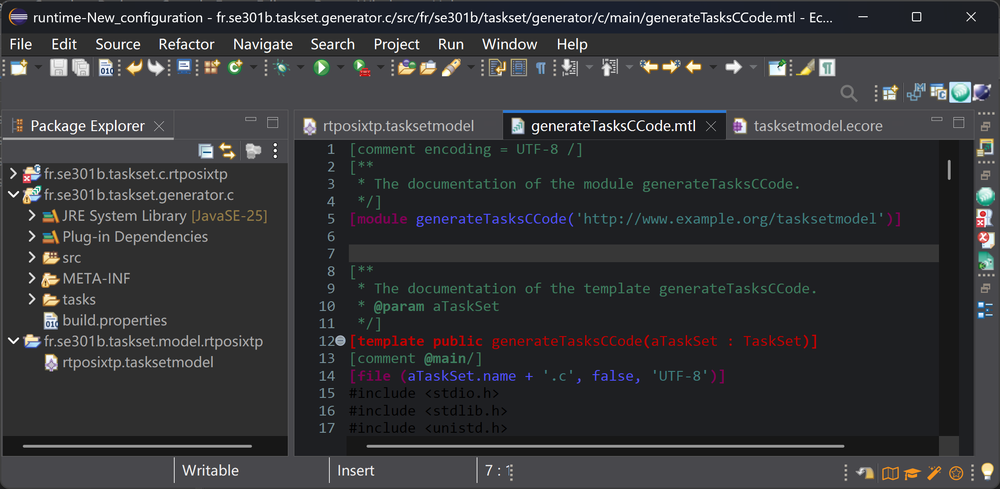
</div>

### 3.3.2 Running the Transformation
Originally there is already a `main_original.c` in the zip file `fr.se301b.taskset.c.rtposixtp.zip`, which is different from the original `main.c`. So `main.c` is renamed:

- `main.c` -> `main_4THREADS.c`

Such that `main_original.c` represents the original code where `NB_THREADS` is 3.

This picture shows the result of comparison between the generated `main.c` and the original `main_original.c`. The generation can be considered as succeesful since the difference between the two is only an extra `\n` at the end of the file.

<div align="center">
  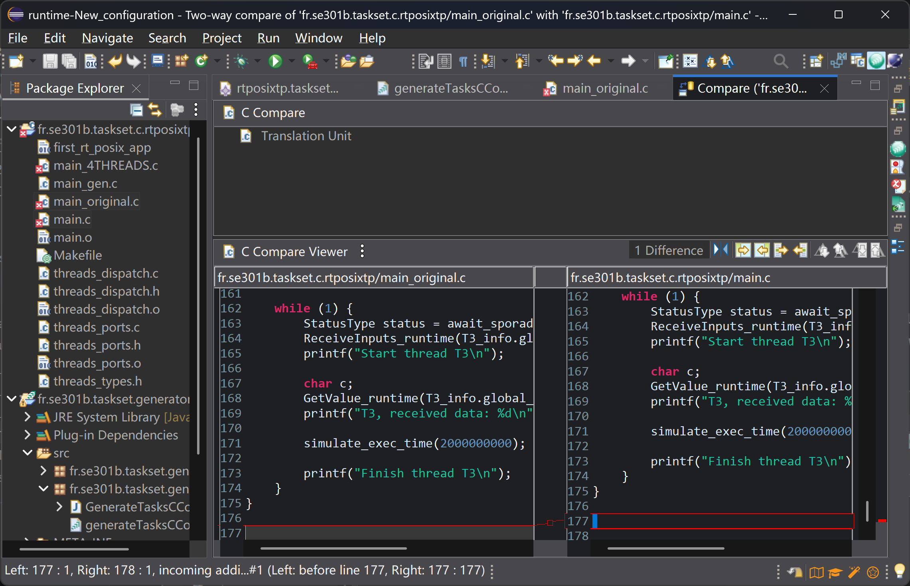
</div>

## 3.4 Overall Translation Mapping
## 3.5 Main C File Code
## 3.6 Tasks

### 3.6.1 Number of Threads
Replace line `#define NB_THREADS 3` in the mtl file `generateTasksCCode.mtl` in `/fr.se301b.taskset.generator.c/src/fr.se301b.taskset.generator.c.main/` with the following line:
```java
#define NB_THREADS [aTaskSet.task->size()/]
```
Note that the type of the child of the designed class `TaskSet` is not `ownedTasks` as given in the tutorial but `task` here.

<div align="center">
  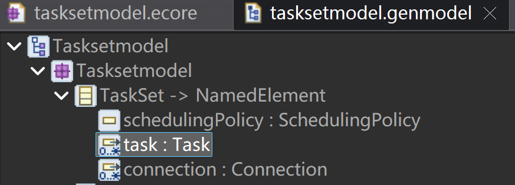
</div>


Then run the program again. Now the generated `main.c` has the required line:
<div align="center">
  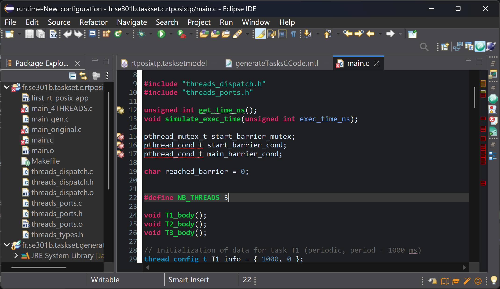
</div>

### 3.6.2 Thread Function Declarations
Comment the original code block and replace it with the given code:

<div align="center">
  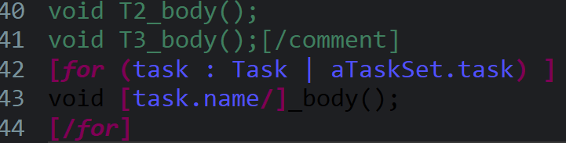
</div>

Then generate `main.c` again. Finally successful:
<div align="center">
  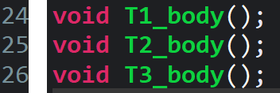
</div>

### 3.6.3 Names Translations

Successfully replace dash character `-` with `_`:
<div align="center">
  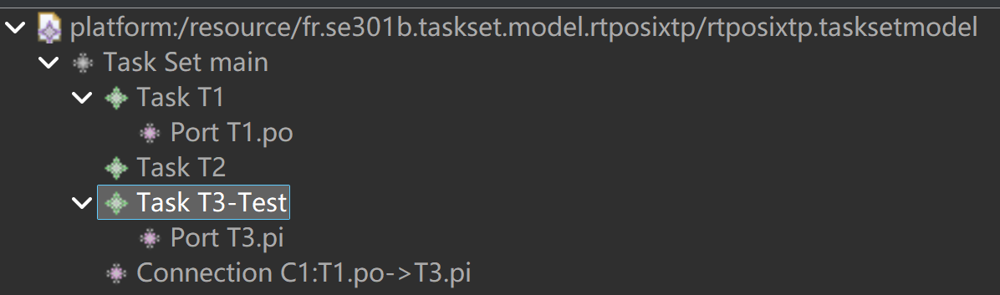
</div>

<div align="center">
  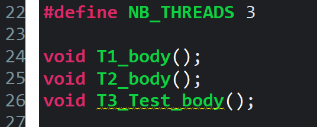
</div>


### 3.6.4 Thread Configurations

<!-- Cannot use `task.threadKind` directly. Here Eclipse insists that `task.threadKind` is a sequence of `threadKind`, even the attribute of `task`, `UpperBound`, is 1. I have to use `task.threadKind->asSequence()->first()` to obtain the firse element of `task.threadKind`.
```java

[comment][if (task.threadKind = ThreadKind::periodic)][/comment]
[if (task.threadKind->asSequence()->first() = tasksetmodel::ThreadKind::periodic)]
// Initialization of data for task [task.name/] (periodic, period =
[task.period/] ms)
[else]
// Initialization of data for task [task.name/] (sporadic, minimum delay =
[task.period/] ms)
[/if]

``` -->

Query. Here a strange phenomenon is that for `tasksetmodel::PortDirection`, the two directions are in and out, but to use direction in, `tasksetmodel::PortDirection::_in` is required, instead of `tasksetmodel::PortDirection::in`, while `tasksetmodel::PortDirection::out` is legal.

```java
[query private connections (p : Port) : OrderedSet(Connection) = 
    p.eContainer(TaskSet).connection->select(c | c.sourcePort = p or c.dstPort = p) 
/]

[query private isConnected (p : Port) : Boolean = 
    not p.connections()->isEmpty() 
/]

[query private connectedInputPorts (t : Task) : OrderedSet(Port) = 
    t.port->select(p | p.direction = tasksetmodel::PortDirection::_in)->select(p | p.isConnected()) 
/]

[query private listof(token: String, nbToken : Integer) : String =
    if nbToken <= 1 then token else token + ', ' + self.listof(token, nbToken - 1) endif
/]
```

The `for` block：

```C
[for (t : Task | aTaskSet.task)]
void [t.name.normalize()/]_body();

// Initialization of data for task [t.name/] ([t.threadKind/], period = [t.period/] ms)
[if (t.threadKind = tasksetmodel::ThreadKind::periodic)]
thread_config_t [t.name.normalize()/]_info = { [t.period/], 0 };
[else]
[for (p : Port | t.connectedInputPorts())]
[let con : Connection = p.connections()->first()]
char [t.name.normalize()/]_q_[p.name.normalize()/]_content['['/][con.maxQueueLen/][']'/] = { [listof('0', con.maxQueueLen)/] };
port_queue_t [t.name.normalize()/]_q_[p.name.normalize()/] = { [con.maxQueueLen/], -1, -1, 0, sizeof(char), [t.name.normalize()/]_q_[p.name.normalize()/]_content };
[/let]
[/for]

pthread_mutex_t [t.name.normalize()/]_q_rez;
pthread_cond_t [t.name.normalize()/]_q_event;
extern sporadic_thread_config_t [t.name.normalize()/]_info;
thread_queue_t [t.name.normalize()/]_q = { &[t.name.normalize()/]_q_rez, &[t.name.normalize()/]_q_event, (union thread_config*) &[t.name.normalize()/]_info, 0, 0, 
{ 
 [for (p : Port | t.connectedInputPorts()) separator(',\n')]&[t.name.normalize()/]_q_[p.name.normalize()/][/for]
} };

struct timespec [t.name.normalize()/]_timespec;
sporadic_thread_config_t [t.name.normalize()/]_info = { [t.period/], &[t.name.normalize()/]_timespec, &[t.name.normalize()/]_q, 0 };
[/if]
[/for]
```

The generated `main.c`:

<div align="center">
  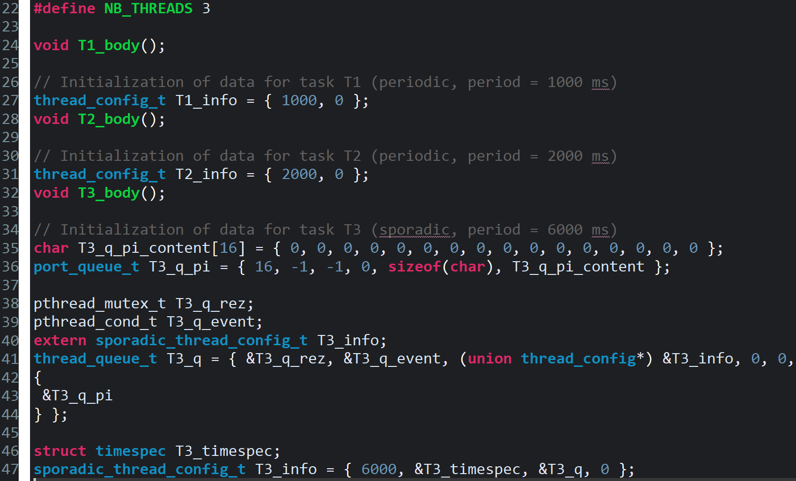
</div>

### 3.6.5 & 3.6.6
We recall that the original `main.c` is renamed as `main_4THREADS.c` in section 3.3.2, in which there are 4 tasks instead of 3. The target of this section is to generate a `main.c` that imitates the behavior of `main_4THREADS.c`.

Define a query to obtain connected output ports. Add this query at the bottom of `mtl` file, similar to the given query `connectedInputPorts` in the tutorial:
```C
[query private connectedOutputPorts (t : Task) : OrderedSet(Port) = 
    t.port->select(p | p.direction = tasksetmodel::PortDirection::out)->select(p | p.isConnected()) 
/]
```

Add a query to automatically calculate the RMS priority: Count the number of unique periods in the system that are greater than the current task's period, then add 1.
```C
[query private getRmsPriority (t : Task, ts : TaskSet) : Integer = 
    ts.task.period->asSet()->select(p | p > t.period)->size() + 1 
/]
```

The defined ecore model, `tasksetmodel`, is constructed as follows(we will not go into all the details about the configuration here):
<div align="center">
  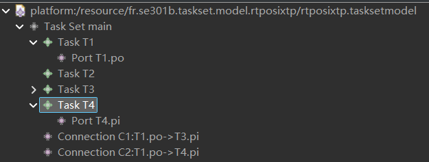
</div>

The `behavior` of each Task:
- Task T1
    ```C
    char PO = 'c'; simulate_exec_time(400000000); // 400 ms
    ```
- Task T2
    ```C
    printf("T2 processing...\n"); simulate_exec_time(800000000); // 800 ms;
    ```
- Task T3
    ```C
    char c; GetValue_runtime(T3_info.global_q, 0, &c); printf("T3, received data: %d\n", c); simulate_exec_time(2000000000); // 200 ms;
    ```
- Task T4
    ```C
    printf("T4 processing...\n"); simulate_exec_time(2000000000); // 200 ms
    ```


Creations and joins are completed in `main()`:

- Thread creations
    ```C
	[for (t : Task | aTaskSet.task)]
    [if (t.threadKind = tasksetmodel::ThreadKind::periodic)]
    init_periodic_config(&[t.name.normalize()/]_info);
    [else]
    init_sporadic_config((thread_config_t*) &[t.name.normalize()/]_info);
    [/if]
    pthread_t [t.name.normalize()/]_tid;
    create_fp_thread(min_prio + [t.getRmsPriority(aTaskSet)/], 40960, (void*) [t.name.normalize()/]_body, &[t.name.normalize()/]_tid, SCHED_FIFO);
    [/for]
    ```

- Thread joins
    ```C
    [for (t : Task | aTaskSet.task)]
    pthread_join([t.name.normalize()/]_tid, NULL);
    [/for]
    ```

Then define the thread function bodies.
```C
[for (t : Task | aTaskSet.task)]
void [t.name.normalize()/]_body() {
    printf("Starting [t.name/]\n");
    pthread_mutex_lock(&start_barrier_mutex);
    reached_barrier++;
    pthread_cond_signal(&main_barrier_cond);
    pthread_cond_wait(&start_barrier_cond, &start_barrier_mutex);
    pthread_mutex_unlock(&start_barrier_mutex);

    while (1) {
        [if (t.threadKind = tasksetmodel::ThreadKind::periodic)]
        // Periodic
        display_relative_date("Start thread [t.name/]", ([t.name.normalize()/]_info.periodic_config).iteration_counter);
        
        [t.behavior/] //Behavior of the task


        [for (p : Port | t.connectedOutputPorts())]
        [for (con : Connection | p.connections())]
        SendOutput_runtime(&[con.dstPort.eContainer(Task).name.normalize()/]_q, [con.dstPort.eContainer(Task).port->indexOf(con.dstPort)-1/], &PO);
        [/for]
        [/for]

        printf("Finish thread [t.name/]\n");
        await_periodic_dispatch(&[t.name.normalize()/]_info);

        [else]
        // Sporadic
        StatusType status = await_sporadic_dispatch([t.name.normalize()/]_info.global_q);
        ReceiveInputs_runtime([t.name.normalize()/]_info.global_q, 0);
        
        [for (p : Port | t.connectedInputPorts())]
        char [p.name.normalize()/];
        GetValue_runtime([t.name.normalize()/]_info.global_q, [i-1/], &[p.name.normalize()/]);
        [/for]

        [t.behavior/] //Behavior of the task

        printf("Finish thread [t.name/]\n");
        [/if]
    }
}
[/for]
```


Use the `mtl` file described above to generate the target code `main.c`. The output of generated `main.c`:

```
Creating thread
Creating thread
Creating thread
Creating thread
Start thread T2 - date: 0 sec: 15607 nsec - iteration 0
T2 processing...
Start thread T1 - date: 0 sec: 28308 nsec - iteration 0
Finish thread T1
Write in index 1, 99 
Write in index 1, 99 
Receive inputs: number of discarded messages is 0
Receive inputs: first: 0, last: 1
T4 processing...
Receive inputs: number of discarded messages is 0
Receive inputs: first: 0, last: 1
T3, received data: 0
Finish thread T2
Start thread T1 - date: 1 sec: 44284 nsec - iteration 1
Finish thread T1
Write in index 2, 99 
Write in index 2, 99 
Start thread T2 - date: 2 sec: 29868 nsec - iteration 1
T2 processing...
Start thread T1 - date: 2 sec: 45797 nsec - iteration 2
Finish thread T1
Write in index 3, 99 
Send output: ERROR, full queue
Finish thread T4
Finish thread T3
Finish thread T2
Start thread T1 - date: 3 sec: 42841 nsec - iteration 3
Finish thread T1
Write in index 4, 99 
Send output: ERROR, full queue
Start thread T1 - date: 4 sec: 38018 nsec - iteration 4
Start thread T2 - date: 4 sec: 38114 nsec - iteration 2
T2 processing...
Finish thread T1
Send output: ERROR, full queue
Send output: ERROR, full queue
Finish thread T2
Start thread T1 - date: 5 sec: 38359 nsec - iteration 5
Finish thread T1
Send output: ERROR, full queue
Send output: ERROR, full queue
Start thread T1 - date: 6 sec: 41062 nsec - iteration 6
Start thread T2 - date: 6 sec: 43410 nsec - iteration 3
T2 processing...
Finish thread T1
Send output: ERROR, full queue
Send output: ERROR, full queue
Receive inputs: number of discarded messages is 1
Receive inputs: first: 2, last: 2
T4 processing...
Receive inputs: number of discarded messages is 1
Receive inputs: first: 2, last: 4
T3, received data: 99
Finish thread T2
Start thread T1 - date: 7 sec: 36937 nsec - iteration 7
Finish thread T1
Write in index 0, 99 
Write in index 0, 99 
...
```


The output of `main_4THREADS.c`:
```Text
Creating thread
Creating thread
Creating thread
Creating thread
Start thread T2 - date: 0 sec: 15607 nsec - iteration 0
T2 processing...
Start thread T1 - date: 0 sec: 28308 nsec - iteration 0
Finish thread T1
Write in index 1, 99 
Write in index 1, 99 
Receive inputs: number of discarded messages is 0
Receive inputs: first: 0, last: 1
T4 processing...
Receive inputs: number of discarded messages is 0
Receive inputs: first: 0, last: 1
T3, received data: 0
Finish thread T2
Start thread T1 - date: 1 sec: 44284 nsec - iteration 1
Finish thread T1
Write in index 2, 99 
Write in index 2, 99 
Start thread T2 - date: 2 sec: 29868 nsec - iteration 1
T2 processing...
Start thread T1 - date: 2 sec: 45797 nsec - iteration 2
Finish thread T1
Write in index 3, 99 
Send output: ERROR, full queue
Finish thread T4
Finish thread T3
Finish thread T2
Start thread T1 - date: 3 sec: 42841 nsec - iteration 3
Finish thread T1
Write in index 4, 99 
Send output: ERROR, full queue
Start thread T1 - date: 4 sec: 38018 nsec - iteration 4
Start thread T2 - date: 4 sec: 38114 nsec - iteration 2
T2 processing...
Finish thread T1
Send output: ERROR, full queue
Send output: ERROR, full queue
Finish thread T2
Start thread T1 - date: 5 sec: 38359 nsec - iteration 5
Finish thread T1
Send output: ERROR, full queue
Send output: ERROR, full queue
Start thread T1 - date: 6 sec: 41062 nsec - iteration 6
Start thread T2 - date: 6 sec: 43410 nsec - iteration 3
T2 processing...
Finish thread T1
Send output: ERROR, full queue
Send output: ERROR, full queue
Receive inputs: number of discarded messages is 1
Receive inputs: first: 2, last: 2
T4 processing...
Receive inputs: number of discarded messages is 1
Receive inputs: first: 2, last: 4
T3, received data: 99
Finish thread T2
Start thread T1 - date: 7 sec: 36937 nsec - iteration 7
Finish thread T1
Write in index 0, 99 
Write in index 0, 99
...
```


The two output logs are similar, showing that the code generation is successful.